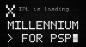

# pxmil — X millennium for PSP

SHARP X1 エミュレータ **X millennium** の PSP 移植です。
[xmil-libretro](https://github.com/libretro/xmil-libretro)（公式 SVN trunk のミラー）をベースに、
PSP 用のフロントエンド（`psp/`）を追加しています。
上流のソースツリーは `xmil/` 以下にあります。

> **ゲーム本体 (縦持ちゼビウス) は別リポジトリ `zxevious` へ移動しました。**
> 以前 `tools/` 配下で開発していた X1 turboZ 用デモ (emmscroll64.asm / sprite.inc /
> ship.inc / xevi_*.py など) は、`git filter-repo` で履歴ごと `zxevious` に切り出しました
> (隣接配置: `../zxevious`)。このリポジトリにはエミュレータ本体と汎用テストツール
> (`tools/tz*.asm`, `tools/ppsspp-run.sh`, `tools/mkx1disk.py`, `tools/device-test.sh`) のみ残しています。



## 特徴

- 実機 PSP で全区間 60fps 動作
  - GU によるパイプライン描画（テクスチャ VRAM ステージング + 32px スライス）
  - ディスクイメージの RAM キャッシュ（セクタ単位のメモステ I/O を排除）
  - 333MHz 駆動、PGO ビルド対応
- SDL2 サウンド（PSG / OPM、22050Hz）
- 内蔵疑似 IPL により ROM ファイルなしで起動可能
- リスト型メニュー、ソフトウェアキーボード、連射、アスペクト 3 モード
- 設定は `xmil.cfg` に自動保存

## 導入

1. [Releases](https://github.com/j3tm0t0/pxmil/releases) から `EBOOT.PBP` を取得し
   `ms0:/PSP/GAME/PXMIL/EBOOT.PBP` に置く（CFW 導入済み PSP が対象）
2. ディスクイメージ（`.2d` / `.d88` / `.88d` / `.2hd`）を
   `ms0:/PSP/GAME/PXMIL/disk/` に置く
3. 起動すると `disk/` の最初のイメージが FDD0 に自動マウントされ、
   疑似 IPL からブートします。入替はメニューから

## 操作

| ボタン | 機能 |
|---|---|
| D-pad / アナログ | X1 ジョイスティック |
| ○ / × | ボタン 1 / 2 |
| △ / □ | ボタン 1 / 2 の連射（約 16 連/秒） |
| L | ソフトウェアキーボード開閉 |
| R | アスペクト切替（ドット等倍 8:5 / 実機 4:3 / 引き伸ばし） |
| L+R 同時 | ○× 入れ替え |
| SELECT | メニュー（ディスク入替・リセット・CPU クロック・FPS 表示・終了） |
| START | リセット |

メニュー・キーボード内は D-pad で移動、○ で決定、× で戻る/閉じる。

## ビルド

[pspdev](https://pspdev.github.io/) のツールチェーン（SDL2 入り）が必要です。

```sh
make -f Makefile.psp            # EBOOT.PBP を生成
make -f Makefile.psp PGO=use    # pgo/ のプロファイルを使った最適化ビルド
```

`tools/ppsspp-run.sh` で PPSSPP に配備して起動、
`tools/device-test.sh [秒数] [ラベル]` で実機への転送〜自動プレイ〜
性能ログ回収まで無人で行えます（pspbrew.dev のデバッグ機能を利用）。

## 謝辞

- **ぷにゅ氏** — X millennium（X1 エミュレータ）の原作者。
  この移植のすべての土台です
- **ゆい氏（猫プロジェクト / [retropc.net/yui](http://retropc.net/yui/xmil.html)）** —
  X millennium の基盤となった Neko Project II のアーキテクチャと、
  長年の配布・保守
- **[TurboZ](https://www.turboz.to/)** — X millennium の開発・情報サイト
- **libretro チーム / r-type 氏** — 本リポジトリのベースにした
  [xmil-libretro](https://github.com/libretro/xmil-libretro)
  （ソースミラーと各プラットフォーム移植の整備）
- **[pspdev](https://pspdev.github.io/) プロジェクト** — PSP ツールチェーン、
  PSPSDK、SDL2 移植
- **[PPSSPP](https://www.ppsspp.org/)** — 開発サイクルを支えたエミュレータ
- X millennium Web（[x1.onoda-pro.com](https://x1.onoda-pro.com/)）—
  挙動比較の参照に利用させていただきました

## ライセンス

エミュレータ本体のライセンスは上流に従います。同梱の
[xmil/LICENSE](xmil/LICENSE) / [xmil/readme.txt](xmil/readme.txt) を参照してください。
PSP フロントエンド（`psp/`）も同条件とします。
ゲームのディスクイメージは含みません。各自が権利を有するものをご利用ください。
